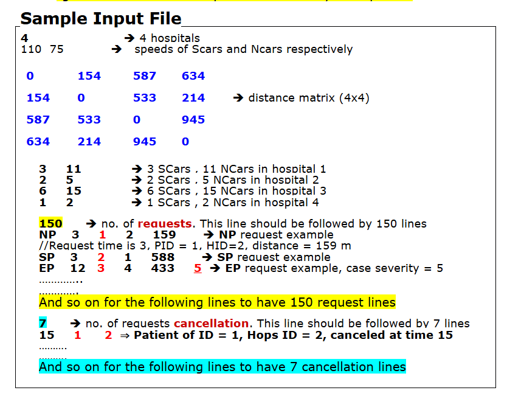

<a id="readme-top"></a>
[](https://www.linkedin.com/in/ibrahim-hesham-abdel-dayem/)

<!-- PROJECT LOGO -->
<br />
<div align="center">
  <a href="#">
    
  </a>
  <h3 align="center">Ambulance Management System</h3>
</div>


<!-- TABLE OF CONTENTS -->
<details>
  <summary>Table of Contents</summary>
  <ol>
    <li>
      <a href="#about-the-project">About The Project</a>
      <ul>
        <li><a href="#built-with">Built With</a></li>
      </ul>
    </li>
    <li><a href="#project-details">Project Details</a></li>
    <li><a href="#file-structure">File Structure</a></li>
    <li><a href="#sample-input-file-structure">Sample Input File Structure</a></li>
    <li><a href="#running-the-project">Running the Project</a></li>
    <li><a href="#simulation-output-example">Simulation Output Example</a></li>
    <li><a href="#license">License</a></li>
  </ol>
</details>

<!-- ABOUT THE PROJECT -->
## <a id="about-the-project"></a>🚑 About The Project

This project simulates the operations of an Ambulance Management System that manages patient requests and car assignments across multiple hospitals. Developed as part of the Data Structures and Algorithms course, it focuses on efficient use of queues, priority queues, and file handling to reflect real-time emergency service behavior.

The system handles Emergency (EP), Special (SP), and Normal (NP) patient requests, assigns cars (with or without special facilities), simulates the process over time steps, and calculates performance statistics.

It is also an exercise in applying data structures to model real-world scenarios, allowing complex hospital operations to be simulated in milliseconds. The system can log into any hospital setup and instantly calculate metrics such as average wait time, car utilization, and failed assignments, making it possible to test multiple operational scenarios and evaluate hospital performance under different conditions.

<p align="right">(<a href="#readme-top">back to top</a>)</p>

## <a id="built-with"></a>🛠️ Built With

[](https://isocpp.org/)
[](#)
[](#)


---

## <a id="project-details"></a>📄 Project Details

## 👨‍⚕️ Key Features
- **Time-step based simulation engine** for real-time event modeling.  
- **Handles 3 patient types**: Emergency (EP), Special (SP), and Normal (NP).  
- **Custom-built Priority Queues** (for EP & SP) and **Custom-built FCFS Queues** (for NP) — implemented **from scratch without STL**.  
- **Dynamic car assignment** based on patient priority and available car type (special or normal).  
- **NP request cancellations** handled through input files.  
- **EP rerouting** to the nearest hospital when the target hospital is at capacity.  
- **Performance tracking**: car busy time, patient wait time, service completion rates.  
- **Two simulation modes**: Interactive (step-by-step view) & Silent (only logs output).  
- **Extensive file I/O** for reading simulation scenarios and logging outputs.  
- **Scalable design**: can easily simulate different numbers of hospitals, cars, and patients.  


### 🧮 Data Structures Used

- **Priority Queue**: For emergency patients (EP)
- **Queue (FCFS)**: For special (SP) and normal (NP) patients
- **Graph (Distance Matrix)**: Represents hospital distances
- **File I/O**: For reading inputs and writing outputs
- **Linked Lists / Arrays**: For tracking cars, patients, and hospital data

---

## <a id="file-structure"></a>📂 File Structure

- A folder named **`Input and Output Files`** is included in the project.
- It contains multiple example input files along with their corresponding output files.
- You can use these to explore how different input scenarios affect the simulation results.
- To test your own input, place your file in the **project directory** and name it **`sample_input.txt`** before running the simulation.

---

## <a id="sample-input-file-structure"></a>📄 Sample Input File Structure

When adding your own input file (**`sample_input.txt`**) to the project directory, follow this exact structure so the simulation can read it correctly:



⚠ **Important:**  
- Ensure there are no extra blank lines between sections.  
- Patient requests appear before cancellations in the file.
- The order of these sections must be preserved for correct simulation.

---


## <a id="running-the-project"></a>🚀 Running the Project

### ✅ Prerequisites

- A C++ compiler (e.g., Visual Studio, Code::Blocks, or g++)
- Basic knowledge of file operations

### 🛠️ Build & Run

### <a id="installation"></a>Installation

1. **Clone the repository**

   ```sh
   git clone https://github.com/ibraaahim11/Ambulance-Management-System.git
   ```

2. **Open the project in Visual Studio**

   - Launch Visual Studio.
   - Open the cloned folder.
   - Double-click on `DSA Project Team 18.sln` to open the solution.

3. **Build and Run**

   - Press `F5` or click the "Start" button in Visual Studio to build and run the project.

---

## <a id="simulation-output-example"></a>📊 Simulation Output Example

After running the simulation, the program will generate an output file similar to the example below:

```
        FT       PID        QT        WT
         8         3         2         3
         8         7         4         2
         8         6         4         2
         9         1         1         4
         9        12         5         2
        11        15         7         2
        12         8         4         4
        13        10         5         4
        14        19        10         2
        15         2         1         7
        15        13         5         5
        15        17         7         4
        16        21        10         3
        17        23        11         3
        18        20        10         6
        19        16         7         6
        21        24        11         5
        22         5         2        10
        23         9         5         9
        24        27        12         6
        25        29        13         8
        26        18        10         8
        27        11         5        11
        27        22        11         8
        28        26        12         8
        28        25        12        11
        30        30        14         8
Patients: 30 [NP: 8, SP: 12, EP: 10]
Hospitals = 4
Cars: 38 [SCar: 16, NCar: 22]
Avg Wait Time = 5.59
Avg Busy Time = 7.47
Avg Utilization = 24.91%
Failed Cars= 1, Percentage: 2.632%
```

## Explanation of Columns

- **FT**: Finish Time — the time unit when the patient request is completed.
- **PID**: Patient ID — unique identifier for each patient.
- **QT**: Queue Time — how long the patient waited in the queue before being served.
- **WT**: Wait Time — total time the patient waited from request until being served.

## Summary Section
- **Patients**: Total patients served with a breakdown by type:
  - **NP**: Normal Patients
  - **SP**: Special Patients
  - **EP**: Emergency Patients
- **Hospitals**: Number of hospitals in the simulation.
- **Cars**: Total number of cars available with a breakdown:
  - **SCar**: Special Cars
  - **NCar**: Normal Cars
- **Avg Wait Time**: Average time patients wait before service.
- **Avg Busy Time**: Average time cars spend transporting patients.
- **Avg Utilization**: Percentage of time cars are actively being used.
- **Failed Cars**: Number and percentage of cars that failed during the simulation.
---

## <a id="license"></a>📜 License

This project was developed for academic purposes only and is not licensed for commercial use or distribution. Public sharing of the code before final exams is strictly prohibited as per university guidelines.

<p align="right">(<a href="#readme-top">back to top</a>)</p>
